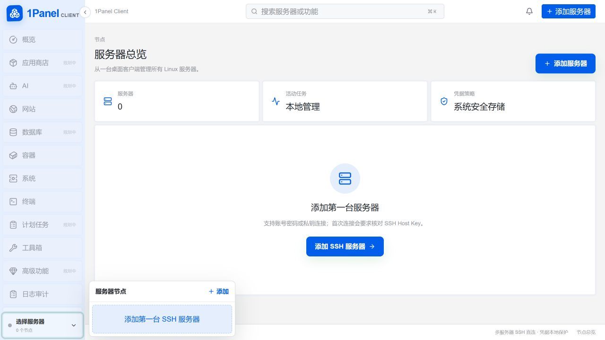

# 1Panel Client

1Panel Client 是面向多台 Linux 服务器的桌面管理客户端。它以 1Panel v2 的信息架构和视觉语言为产品基准，但不要求在每台服务器安装 1Panel 服务端：服务器通过 SSH、SFTP 和已有 Linux 命令接入，密码、私钥口令与 sudo 凭据保存在本机操作系统安全存储中。

> 当前版本为 `0.1.0`。客户端通过 SSH/SFTP 管理多台 Linux 服务器，已覆盖概览、文件、终端、系统安全、网站/OpenResty、Docker、应用商店、AI、数据库、计划任务和高级探活等核心流程；矩阵中的 `[~]` 表示仍有 1Panel 专属深度能力待补齐。所有已接入模块均读取真实远端结果，不以静态 Mock 冒充完成。详见 [功能覆盖矩阵](docs/FUNCTION_MATRIX.md)。

## 界面预览



## 核心能力

- 多服务器档案、分组、收藏、节点快速切换与多级 ProxyJump（链路展示、循环检测）
- 密码/私钥/SSH Agent SSH、严格 Host Key 校验与可复用连接
- SFTP 文件浏览、上传/下载、Monaco 编辑、冲突检测与 sudo 保存
- 多标签 SSH 终端、快捷指令、短期命令历史
- CPU、内存、磁盘、网络、进程、端口与 systemd 管理
- 真实 lsblk/findmnt/df/fstab 磁盘与挂载快照，受控挂载/卸载和带备份回滚的 fstab 维护
- Nginx 反向代理解析、配置测试、备份、回滚与 reload
- OpenResty 静态站点与反向代理、HTTPS 元数据、ACME HTTP-01/DNS-01（Cloudflare/阿里云/DNSPod/腾讯云/AWS Route 53 acme.sh）、PHP-FPM 安装与站点绑定、同域证书自动绑定、配置测试与安全探活
- Docker 容器、镜像、卷、网络、Compose、日志、Inspect、Exec、Pull/Run/Build（含流式输出与取消）与最近 Events 摘要
- 应用商店官方/静态镜像 Compose 模板安装、TTL 缓存与离线回退、最多 8 个有序镜像节点故障转移、生命周期、卸载后恢复、日志、升级前 Compose 差异预览、官方分支提交号显示、最新版本升级回滚、环境变量合并编辑、容器健康检查与基于 project label 的清理候选预览；镜像契约见 [APPSTORE_MIRROR.md](docs/APPSTORE_MIRROR.md)
- MySQL/MariaDB/PostgreSQL/Redis 探测、数据库/用户与真实数据库级权限矩阵、备份恢复、服务控制、Redis ACL 用户创建/删除/授权/撤销/重置密码、Redis 键管理、字符串与 hash/list/set/zset 受控编辑、复杂值远端快照导入导出、支持 AUTH/AUTH2 且保留类型/TTL 的 MIGRATE 跨实例迁移、apt/dnf/apk/pacman 引擎安装计划与安装后命令/版本/systemd/OpenRC 验证
- 远程 crontab（Shell、多地址 URL、目录/网站/应用/数据库/日志备份任务、UTC 时间戳归档、按份数/天数轮换、版本化 JSON 导入导出与本地历史清理）/systemd timer；计划任务可选本机目录、WebDAV、S3 兼容对象存储或独立 SFTP 账号，secret 进入系统密钥链，手动归档上传支持原子替换，客户端在线时可自动补传离线期间完成的归档；报告支持通用 JSON、Slack、Discord、钉钉 HMAC 和企业微信；UFW/firewalld/nftables 与 SSH 安全配置
- OpenAI-compatible AI 供应商密钥链配置、真实 `/models` 探测、可取消 SSE 流式响应、只读服务器概览/网站/Docker/安全快照智能体、按供应商隔离的本地会话恢复/清理与可选 MCP stdio 工具
- WAF/ModSecurity 规则摘要与受控增删、内置 OWASP CRS 4.25.1 LTS/4.28.0 固定 SHA-256 来源（宿主机/容器安装、更新、移除均备份并在配置测试/reload 失败时回滚）、主机及匹配容器日志告警、阈值/本地历史/应用内通知、系统密钥链 webhook 外部通知（通用 JSON、Slack、Discord、钉钉、企业微信；钉钉可选 HMAC 签名密钥）、HTTP 探活任务持久化/调度/历史、本地任务中心、审计记录、脱敏诊断与加密完整备份

## 技术栈

- Tauri 2 + Rust stable + Tokio
- React 19 + TypeScript + Vite
- TanStack Query、Zustand、Radix UI、ECharts、Monaco、xterm.js
- russh + russh-sftp、SQLite/sqlx、OS Keychain

## 开发

需要 Node.js 22+、pnpm 10+、Rust stable，以及 Tauri 2 对应平台依赖。

```bash
pnpm install
pnpm tauri dev
```

前端开发服务使用 `1430` 端口，避免与原 `server-manager` 的 `1420` 端口冲突。

## 验证

```bash
pnpm lint
pnpm typecheck
pnpm test --run
pnpm build

cd src-tauri
cargo fmt --check
cargo clippy --all-targets --all-features -- -D warnings
cargo test --all-features
```

## 安全边界

- React 不构造或执行任意远程 shell；远程操作由 Rust 白名单命令处理。
- 凭据不写入 SQLite、LocalStorage、日志或诊断包。
- 首次连接必须确认 Host Key；密钥变化会阻止连接。
- Docker 通过 SSH 上的 CLI 管理，不暴露 Docker TCP API。
- 安装、删除、服务变更等操作必须由用户在界面明确触发并验证结果。

## 上游与许可证

本项目的产品基准来自 [1Panel](https://github.com/1Panel-dev/1Panel)，参考版本为 v2.2.5 与上游提交 `14728f889e810d5a0c19eaa4a923110921ebe7b7`。1Panel 是深圳市飞致云科技有限公司的开源项目；本项目是独立的社区客户端，不代表 1Panel 官方产品，也不复制官方商标图形。

项目采用 [GNU GPL v3](LICENSE) 许可证。修改与来源说明见 [NOTICE](NOTICE)。
